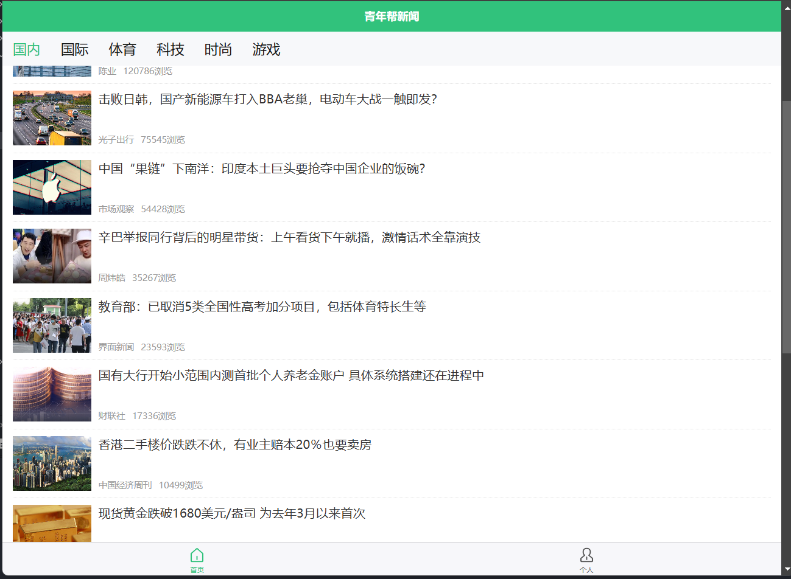

# README

# 新闻 Demo 项目

## 项目概述

这是一个基于 UniApp 和 Vue 2 的新闻展示 Demo 项目，使用 HBuilder X 进行开发。项目提供了新闻列表、新闻详情、用户浏览历史等基本功能，主要用于展示跨平台小程序开发的实现方式。

## 项目开发技术

- **UniApp**: 实现跨平台开发，支持 Android、iOS、小程序等多端。
- **Vue 2**: 使用 Vue 2 框架，搭建组件化页面结构。
- **HBuilder X**: 项目构建、调试与发布工具。
- **自定义组件**:
    - `newsbox.vue`: 用于显示新闻条目，包括图片、标题、作者和浏览量信息。

## 功能模块

1. **首页**：
    - 新闻分类导航，实现新闻条目列表展示。
    - 通过接口获取新闻数据，支持无数据和加载中状态显示。
    
    
    
2. **用户中心**：
    - 保存用户的浏览历史记录，支持点击跳转到相应新闻详情页。
    - 当无浏览记录时显示默认提示。
    
    
    
3. **新闻详情页**：
    - 展示完整的新闻内容，包括标题、作者、发布日期和正文内容。
    - 使用 `rich-text` 组件显示富文本，内容来源声明。
    
    
    

## 开发流程

1. **需求分析**：确定新闻展示需求，设计页面逻辑和交互流程。
2. **项目搭建**：配置 `pages.json` 以设置页面路径和底部导航。
3. **功能开发**：使用组件化开发实现首页、用户中心和新闻详情页，并接入后端 API 获取新闻数据。
4. **测试与调试**：调试 API 请求，测试页面跳转和状态显示效果。
5. **部署与上线**：完成测试后在不同平台发布应用。

## 代码规范

- **文件命名**：页面和组件文件名使用小写并用中划线连接。
- **组件传参**：使用 `props` 传递数据（如 `newsbox` 组件的 `item` 属性），并提供默认值。
- **样式与单位**：采用 `rpx` 单位适配多端设备，颜色使用主题色 `#31C27C`。
- **注释规范**：在 API 请求、组件传参等重要位置添加注释，确保代码易读。

## 代码审查流程

- **工具**：使用 Git 管理代码版本，HBuilder X 调试和调优。
- **审查流程**：
    - **代码格式**：检查代码缩进、空格和注释，确保符合团队统一规范。
    - **功能验证**：测试 API 请求和页面交互，确保符合需求。
    - **性能优化**：减少重复请求、避免不必要的重渲染。
    - **样式一致性**：确认页面样式与设计一致。